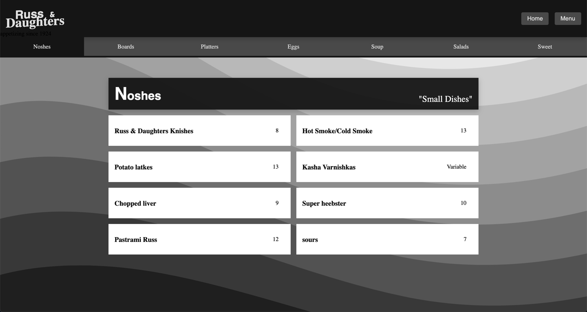

# CSS to the Rescue @cmda-minor-web 19-20 | Russ & Daughters menu

For this project I restricted myself with the following principles:
- **Make it responsive without media queries.**
- **Only use two colors. (Only thing I did was add opacity).**

And a challenge for myself: stuff I normally do with javascript and classes I want to be able to do with css only ~~*(hindsight: don't do it)*~~.

### The website
[](https://gijslaarman.github.io/css-to-the-rescue-1920)
> Click on the image to go to the webpage.

## Table of contents
- [Installation](#installation)
- [Structure](#structure)
- [Experimenting](#experimenting)
- [Thoughts](#thoughts)
- [License](#license)

## Installation
Copy & paste in your terminal & desired folder:
```bash
git clone https://github.com/gijslaarman/css-to-the-rescue-1920.git && cd css-to-the-rescue-1920
```

## Structure
Since this project is HTML/CSS only, the only files there are _drum roll_, are the index.html & styles.css.

## Experimenting
I've got quite a bit of knowledge of CSS already. But to make it truly interactive I've mostly used javascript as a little tool to help. So I challenged myself to use absolutely _no_ javascript.

So I've made a lot of versions to make the food menu scroll sidewards but it was to no avail every time. Until I implemented the radio buttons, but even those were not able to style responsively due to the scope of CSS.

#### CSS experimentions:
- :target
- :not()
- :first-letter
- flex-property (grow, shrink) for child elements
- stroke:
    - *-dasharray
    - *-offset
    - _Animating_
- Using radio buttons for interaction
- Use 3d transitions, creating flippable cards.
- Custom-properties
- Nesting custom properties
- Use a lot of bullshit selectors that make your code almost unreadable: `[menu] > div > div`.

But what I mainly struggled with is the interaction and make it feel like a modern webpage, without the use of javascript. 

#### What I normally would do
I'm going to be honest the result doesn't look like a modern webpage. I had a plan, but it was mainly make a menu and I want to scroll through the different categories. The rest is all done on the fly which is quite visible to me in the end result.

Normally I would make up a design in sketch (for like 90%). Then I know exactly what HTML elements need to be styled and how so I can keep it to a global scope. Like:
```css
h1, h2, h3, h4 {
    font-weight: bold;
    font-family: serif;
}

form {
    display: block;
    max-width: 20em;
    margin: 0 auto;
}

input, textarea, label {
    display: block;
}
``` 
This time I went in guns blazing and basically creating a mess of a css file.

## Thoughts
So I missed an entire weeks worth of work due to illness. The extra time would have helped a bit, but in all fairness it would have not made it any prettier. Or it would have not made me anymore proud of this. 

## License
This project is under [MIT License](https://github.com/gijslaarman/css-to-the-rescue-1920/blob/master/LICENSE)